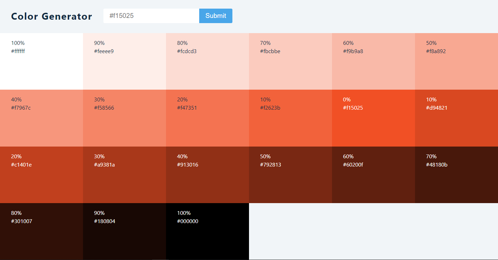
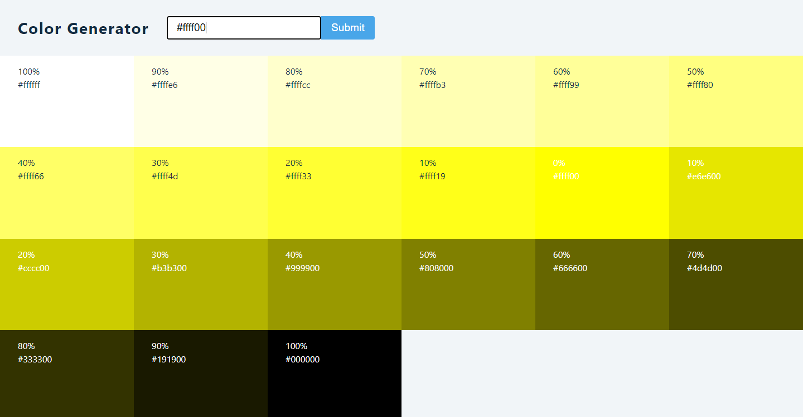
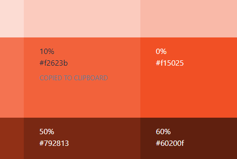

## React Project 6

<hr>

#### _**COLOR GENERATOR**_

To get the color values, I have used
[_***VALUES.JS***_](https://github.com/noeldelgado/values.js)

You can also copy the color hex code on clipboard.

To view in your local system, fork the project and install the dependencies using the below commands:

```shell
>> npm install
>> npm start
```

<br>

<p align="center">
  
</p>

<p align="center">
  
</p>

<p align="center">
  
</p>
